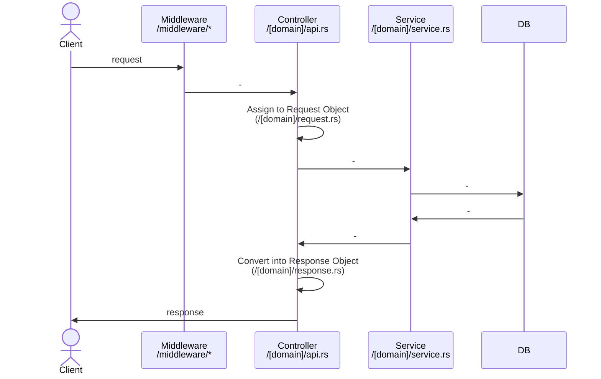

# Overview

Realworld App using `Rust`, `actix-web`, and `diesel`.

## Getting Started

<details>
  <summary>Docker</summary>
  
  ```zsh
  $ docker-compose up -d
  $ curl http://localhost:8080/api/healthcheck
  # => OK
  ```
</details>

<details>
  <summary>Local</summary>
  
  ```zsh
  # start postgres
  $ brew services start postgres
  # start app
  $ disel setup
  $ cargo run
  ```

</details>

## e2e test

```zsh
# run e2e
$ APIURL=http://localhost:8080/api sh e2e/run-api-tests.sh
```

## Architecture

### Req to res flow



## LICENSE

MIT
