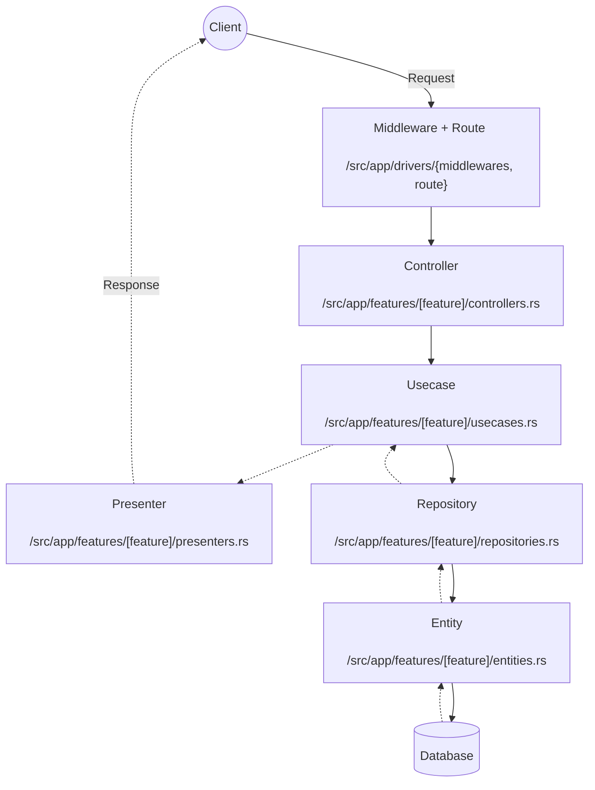

<a href="https://github.com/snamiki1212/realworld-v1-rust-actix-web-diesel"></a>

<a href="https://github.com/snamiki1212/realworld-v1-rust-actix-web-diesel/actions?query=branch%3Amain"></a>

# Overview

Realworld App using `Rust`, `actix-web`, and `diesel`.

## Getting Started

```zsh
# ready
$ sh ./scripts/copy-env.sh

# start
$ docker compose up -d

# healthcheck
$ curl http://localhost:8080/api/healthcheck
# => OK
```

```sh
# Check app can connect to DB
$ curl http://localhost:8080/api/tags
# => {"tags":[]}

# Check app can insert data into DB
curl -X POST http://localhost:8080/api/users -d '{"user": {"email": "a@a.a", "username": "a", "password": "a" }}' -H "Content-Type: application/json"
```

## E2E Test

Running E2E tests using [POSTMAN scripts](https://github.com/gothinkster/realworld/tree/main/api) on CI

```zsh
# run e2e
$ APIURL=http://localhost:8080/api zsh e2e/run-api-tests.sh
```

## Tech Stacks

- Rust Edition 2021
- ActixWeb 4.x
- Diesel 2.x

## Architecture

- Clean Architecture
- DI container using Constructor Injection with dynamic dispatch ([src/utils/di.rs](https://github.com/snamiki1212/realworld-v1-rust-actix-web-diesel/blob/main/src/utils/di.rs))



## LICENSE

MIT
