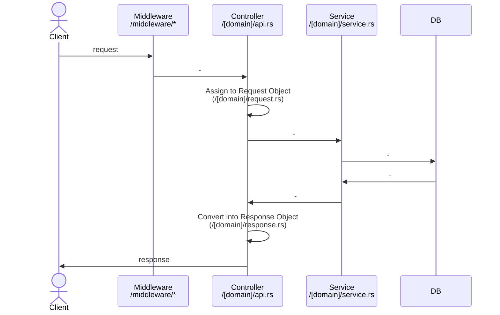

# Overview

Realworld App using `Rust`, `actix-web`, and `diesel`.

## Getting Started

<details>
  <summary>Docker</summary>
  
```zsh
$ cp .env.example .env
$ cp secret.key.example secret.key
```

```zsh
$ docker compose up -d
```

```zsh
$ curl http://localhost:8080/api/healthcheck
# => OK
```

</details>

<details>
  <summary>Local</summary>
  
```zsh
$ cp .env.example .env
$ cp secret.key.example secret.key
```

```zsh
# start postgres
$ brew services start postgres

# start app
$ diesel setup
$ cargo run
```

```zsh
$ curl http://localhost:8080/api/healthcheck
# => OK
```

  </details>

## E2E Test

```zsh
# run e2e
$ APIURL=http://localhost:8080/api zsh e2e/run-api-tests.sh
```

## Tech Stacks

- Rust Edition 2021
- ActixWeb 4.x
- Diesel 1.4.x

## Architecture

### Flow from Request to Response



## LICENSE

MIT
